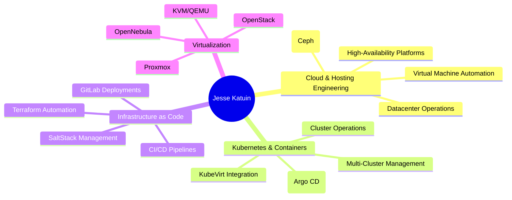

# GitHub Profile README

<!-- Banner -->

  

# 🌟 Jesse Katuin

### 🏗️ Hosting Engineer × ☸️ Kubernetes Specialist × 🛠️ Open-Source Builder

*Designing scalable, automated, open-source-powered infrastructure for the modern cloud.*

---

## 🛠️ Tech Arsenal

### ☸️ Kubernetes & Cloud-Native

### 🖥️ Virtualization & Platforms

### 📦 Infrastructure as Code & Automation

### 🧰 Tools & OS

---

## 📊 GitHub Analytics

---

## 🌟 Professional Focus Areas

---

## 🎯 Current Focus

| 🔥 **Currently Working On** | 🚀 **Exploring** | 🎯 **Goals 2025** |
|:---|:---|:---|
| Automating large-scale hosting deployments | Cluster autoscaling | Expand OSS contributions |
| Building GitLab-based CI/CD pipelines | Edge + lightweight K8s | Streamline HA virtualization |
| Running my own hosting company | K8s security hardening | Launch new IaC modules |

---

## 📈 Contribution Activity

---

### 💌 Let’s Build Something Great!

**🌐 LinkedIn:** https://www.linkedin.com/in/jessekatuin/  
**🌍 Location:** Netherlands  
**🏢 Work:** TrueFullstaq & my own hosting company

---

